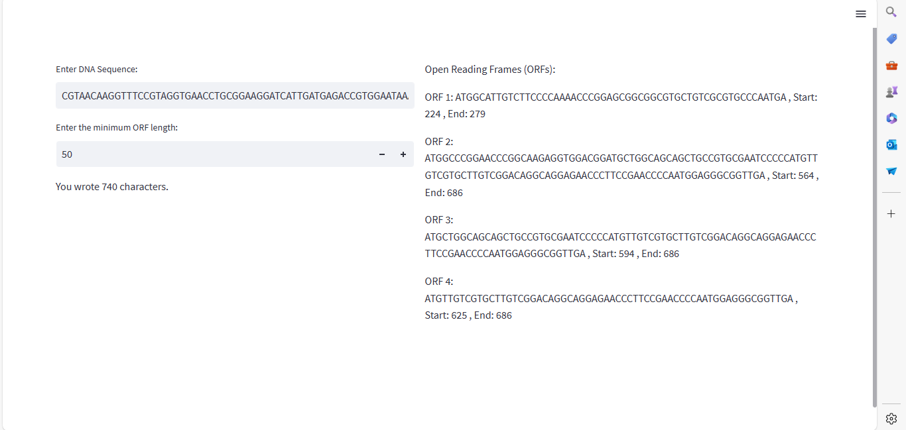
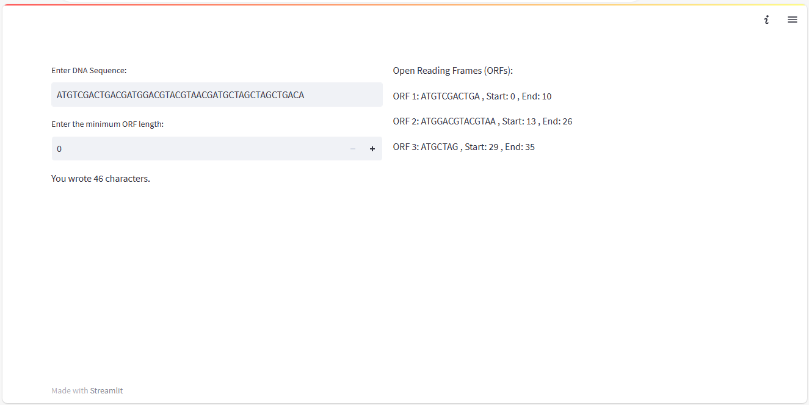

# Open Reading Frames Detection
This application detects Open Reading Frames (ORFs) within a given DNA sequence. An ORF is a sequence of nucleotides that potentially encodes a protein and begins with the start codon "ATG" and ends with any of the three stop codons ("TAA", "TGA", "TAG"). The user inputs a DNA sequence, specifies the minimum ORF length to consider, and the application identifies and displays the ORFs along with their start and end positions.

## Table of Contents

- [Functionality](#Functionality)
- [Setup](#Setup)
- [Dependencies](#Dependencies)
- [Code Structure](#Code-Structure)
- [Usage](#Usage)
- [Usage](#usage)
- [Screenshots](#screenshots)
  
## Functionality:
- **Input DNA Sequence:** Users can input a DNA sequence into the text box provided. The input is validated to ensure it contains valid DNA characters ('A', 'T', 'C', or 'G').
- **Minimum ORF Length:** Users specify the minimum length of ORFs to be considered, ensuring only ORFs of a certain length or longer are included in the analysis.
- **ORF Detection:** The application utilizes regular expressions to search for start codons ("ATG") and stop codons ("TAA", "TGA", "TAG") within the DNA sequence. It identifies ORFs by locating start codons and searching for the nearest stop codon, then checks if the length of the ORF meets the specified minimum length.
- **Output Display:** Detected ORFs, along with their sequences, start positions, and end positions, are displayed in the right column of the interface. If no ORFs are found, a message indicating this is displayed instead.

## Setup:
1. Install Streamlit and Biopython using pip:
     ```bash
     pip install streamlit biopython
3. Run the application by executing `streamlit run app.py` in the terminal.

## Dependencies:
- Streamlit
- Biopython

## Code Structure:
- `app.py`: This file contains the Streamlit application code, including the user interface layout and logic for input validation and ORF detection.
- `Open_Reading_Frames_Detection_Functions.py`: This module contains functions for ORF detection (`find_orfs`) and DNA sequence validation (`validate_dna_sequence`). The `find_orfs` function identifies ORFs within a DNA sequence based on start and stop codons, while `validate_dna_sequence` validates whether a sequence contains only valid DNA characters.

## Usage:
To use the application, simply run `streamlit run app.py` and input a DNA sequence into the provided text box. Specify the minimum ORF length using the number input widget. The application will then display the detected ORFs along with their start and end positions.

## Screenshots



